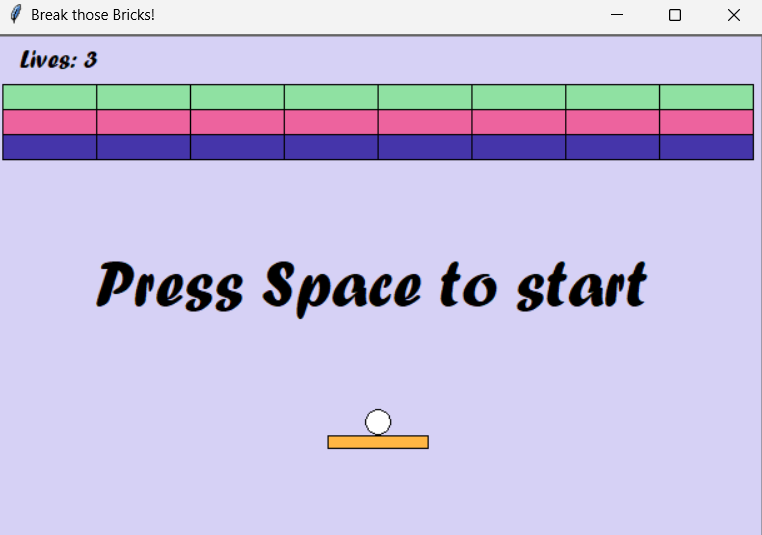
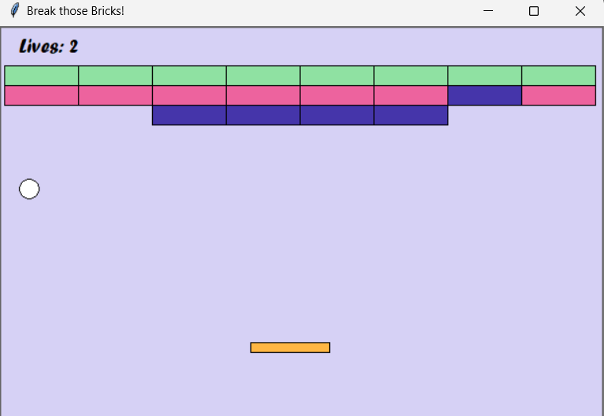
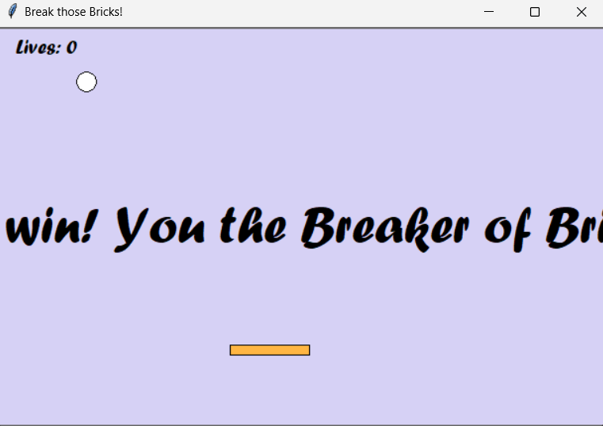

# Brick-Breaker-Game🎮
Brick Breaker is a classic arcade game where a paddle is used to bounce a ball and break a set of bricks. This Python implementation uses libraries like Pygame to create an interactive, fun, and visually engaging game. Players must clear all bricks without letting the ball fall off the screen.

---

## ✨Features
- **Interactive Gameplay: Move the paddle to keep the ball in play and destroy bricks.**
- **Dynamic Ball Movement: Ball speed increases with time or difficulty.**
- **Brick Mechanics: Bricks may have varying strengths (single/multiple hits).**
- **Levels: Multiple levels with increasing difficulty.**
- **Scoring System: Tracks the player's progress with a score counter.**
- **Game Over Condition: Ends when the ball is missed by the paddle.**
- **Visual and Sound Effects: Includes collision animations and sound feedback for actions.**

---

## ⚙️Requirements
**Python: Version 3.6 or later.**
**Pygame: Install it using pip**
**System Requirements: Works on any system with Python and Pygame installed.**

---

## 📖Usage
- **Install Dependencies:**
Ensure Python and Pygame are installed. Use the above installation command for Pygame if needed.

- **Run the Game:**
Save the Python code for the game in a file (e.g., brick_breaker.py) and execute it:

```bash
brickbreaker.py
```
- **Controls:**
Move the paddle using arrow keys or mouse.
Keep the ball in play and break all the bricks to win.

- **Enjoy the Game:**
The objective is to break all the bricks while avoiding losing the ball. You can enhance the game by adding more levels, power-ups, or unique brick types.

## 📷Screenshots
----------------------------------------------
## Start the game



## Playing the game



## Finish the game




